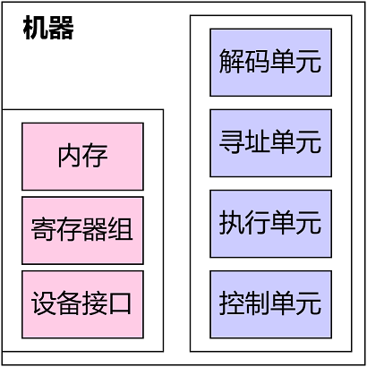
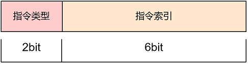
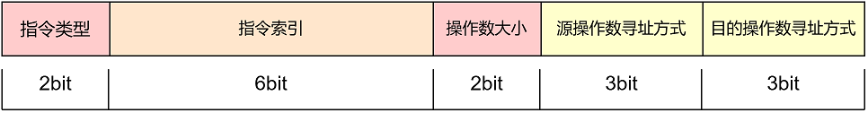
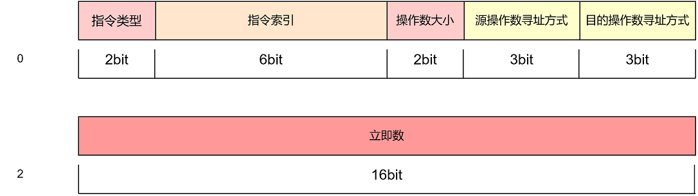
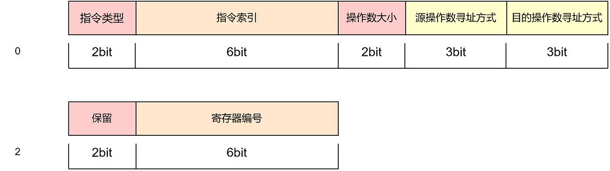
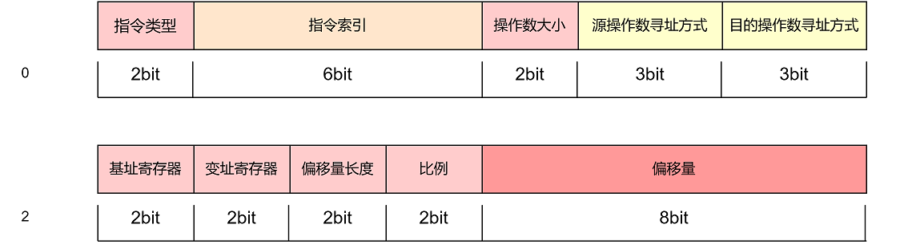

<h1 style="text-align: center;">🦊</h1>

<h1 style="text-align: center;">YabiArch</h1>

# 1.简介

YabiArch是一个使用小端字节序(little-endian)的结构简单的进程虚拟机，可以加载符合其指令集编码的二进制文件并执行。得益于其功能的简洁性，YabiArch具有如下特点：

* 可定制化——通过注册和移除符合指令接口的函数，即可实现指令集的定制
* 松散耦合——主要功能被划分到了不同的模块中，各模块间没有直接依赖，仅通过特定的数据结构交流
* 统一IO——使用统一的IO接口对操作数进行输入输出，降低指令实现的复杂性

# 2.机器模型

YabiArch的机器模型可参考下图：

其中每个组件的作用如下(括号内为该组件在源码中对应的类/对象)：

* 内存(MemoryIO)：提供内存访问功能
* 寄存器组(RegTableIO)：提供寄存器访问功能
* 设备接口(PeriDeviceIO)：提供模拟设备访问功能
* 解码单元(DCU)：将二进制编码的指令的基本属性解码到指令结构体(InstStruct)中
* 寻址单元(ADU)：按照指令中的寻址方式对所访问的目标进行寻址并设置对应的IO对象，以便后续过程使用
* 执行单元(IXU)：根据指令编码找到对应的指令并执行
* 控制单元(MCU)：在指令执行完毕后进行对标志寄存器等进行检查，更改机器信息结构体(MachineInf)以便控制机器的执行

# 3.编码格式与寻址方式

## 3.1.指令的分类

按照指令有无操作数，可大致将指令分为**无操作数指令**和**有操作数指令**两大类。

### 3.1.1.无操作数指令

无操作数指令(源码中称精简指令，具有前缀TIDY)在编码为二进制后占据**1字节**的空间，结构如下：

其中，`指令类型`字段用于告知虚拟机该指令的是否需要操作数以及操作数的个数，对于无操作数指令，该字段固定为**00**；`指令索引`字段用于区分该类型下的不同指令，每个指令占据一种组合，因此每种指令类型下最多可编码64条指令(2^6)。

### 3.1.2.有操作数指令

有操作数指令可再细分为**单操作数指令**(源码中称简单指令，前缀为ORDI)与**双操作数指令**(源码中称复杂指令，前缀为COMP)，其中，单操作数指令的`指令类型`字段固定为**01**，双操作数指令的`指令类型`字段固定为**10**。相比于无操作数指令，有操作数指令增加了一个字节用于提供操作数大小以及操作数的寻址方式，因此有操作数指令在编码为二进制后会占据**2字节以上**的空间(因为指令的操作数还需占据额外的空间)，结构如下：

`操作数大小`字段主要有两个作用，一是在指令的操作数为立即数时，可指示虚拟机在该指令之后有多少字节是立即数，以便虚拟机可正确读取，二是在指令执行阶段告知指令参与运算的操作数的字节大小。该字段可取值及其含义列举如下：

| bit值 | 操作数大小 |
| ----- | ---------- |
| 00    | 1字节      |
| 01    | 2字节      |
| 10    | 4字节      |
| 11    | 8字节      |

`源操作数寻址方式`字段告知虚拟机此指令的源操作数使用哪一种寻址方式，`目的操作数寻址方式`字段则用于目的操作数，效果同理。寻址方式目前有如下几种：

| bit值 | 寻址方式     |
| ----- | ------------ |
| 000   | 立即数寻址   |
| 001   | 寄存器寻址   |
| 010   | 直接寻址     |
| 011   | 间接寻址     |
| 100   | 基址寻址     |
| 101   | 变址寻址     |
| 110   | 基址变址寻址 |
| 111   | 比例变址寻址 |

## 3.2.寻址方式

有操作数指令需要使用额外的字节来存储指令所需的立即数/寄存器编号/存储器寻址方案。我们将寻址方式分为三大类：立即数寻址、寄存器寻址、存储器寻址。其中，立即数寻址需要使用额外的字节保存立即数；寄存器寻址需要使用额外的字节保存寄存器编号；存储器寻址需要使用额外的字节保存存储器寻址方案，根据情况的不同占据的字节数也不同。

### 3.2.1.立即数寻址

立即数寻址即指令所需的操作数被编码到了指令中的情况，在这种情况下，立即数的大小决定了额外占用的字节数，下方是单操作数指令在立即数寻址情况下的结构(为了排版美观，此处假设立即数的大小为16位，即2字节，此时操作数大小字段为01)：

注意，如果是双操作数指令，那么紧随指令之后的第一个立即数/寄存器编号/存储器寻址方案组合被用于源操作数，第二个立即数/寄存器编号/存储器寻址方案被用于目的操作数。

### 3.2.2.寄存器寻址

寄存器寻址意味着指令所需的操作数在指定的寄存器中，在这种寻址方案下需要使用额外的**1字节**空间来保存寄存器的编号，指令结构如下(假设指令为单操作数指令)：

寄存器编号占用6bit，另外2bit暂时保留。所有目前可用的寄存器编号及其作用请参考附录。

### 3.2.3.存储器寻址

如果指令所需的操作数在内存中，那么就需要使用存储器寻址，而存储器寻址又可根据内存地址不同的计算方式细分为如下种类：

* 直接寻址：直接给出一个立即数作为内存地址

* 间接寻址：将一个基址寄存器中的值作为内存地址

* 基址寻址：通过一个基址寄存器和一个作为偏移量的立即数计算出内存地址

* 变址寻址：通过一个基址寄存器和一个变址寄存器计算出内存地址

* 基址变址寻址：通过一个基址寄存器、一个变址寄存器和一个作为偏移量的立即数计算出内存地址

* 比例变址寻址：通过一个基址寄存器、一个变址寄存器和一个作为偏移量的立即数计算出内存地址，使用比例字段放大变址寄存器值

在YabiArch中，可用于寻址的寄存器有如下几个(括号中为bit值)：

| bit值/寄存器编号 | 寄存器 |
| ---------------- | ------ |
| 00               | QBX    |
| 01               | QBP    |
| 10               | QSI    |
| 11               | QDI    |

寄存器的命名只是为了兼容使用习惯，这些寄存器并不区分基址或变址寄存器，具体担任哪一种角色由它们在指令编码中的字段位置决定。下方是使用存储器寻址时，指令的结构(假设指令为单操作数指令，偏移量为8bit)：

在此，我们以X86的存储器寻址语法`[QBX + QSI*4 + 64]`作为参照来讲解图中的各个字段。其中，`基址寄存器`字段用于保存用作基址寄存器的寄存器编号，在本例中为**00**；`变址寄存器`字段用于保存用作变址寄存器的寄存器编号，在本例中为**10**；`偏移量长度`字段用于保存偏移量的字节数，其取值与`操作数大小`字段一致，由于偏移量64可用1字节容纳，因此该字段在本例中为**00**；`比例`字段保存对变址寄存器值的扩大倍数，本例中的扩大倍数为4，因此该字段值为**10**。

## 3.3.实例

* 无操作数指令

* 双操作数指令out

# 项目编译与运行

## 编译yabi.exe

## 编译hello.txt并执行

# 附录

## 寄存器列表

## 指令列表

### 无操作数指令

### 单操作数指令

### 双操作数指令
